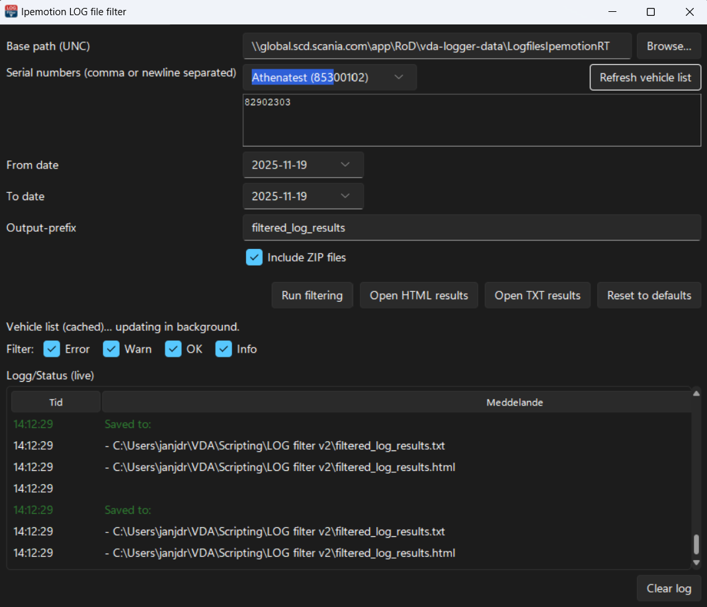

# LOG File Filtering GUI for Ipemotion / Scania VDA

A fast, user-friendly tool for filtering large Ipemotion LOG files by serial number, vehicle name, date range, and keyword sets — plus a **daily vehicle summary** view.



## ✨ Features

### 🔍 Smart Serial & Vehicle Detection

- Automatically finds logger folders in the base path
- Extracts vehicle name from the latest LOG/ZIP file
- Shows entries as `Miguel (82902308)` for easy selection
- Cached for instant startup
- **Add all vehicles** button to quickly include every cached serial in one click

### ⚡ Fast & Asynchronous

- UI stays responsive during file scanning
- Background updating of logger list
- Manual **Refresh vehicle list** button
- Cached serial/vehicle list is auto-refreshed in the background

### 📄 Advanced Filtering

- Search through LOG and ZIP files (per serial + date range)
- Keyword filtering with highlight colors
- Export to **HTML** and **TXT**
- Status log with color-coded messages (Error / Warn / OK / Info)

### 📊 Daily Vehicle Summary

Generate a compact summary for a single day across multiple vehicles:

- One section per vehicle name
- Configuration line(s) at the top
- Protocol lines grouped under the same vehicle
- `mismatch` and `match` highlighted
- Duplicated config/protocol lines are de-duplicated per vehicle
- Extra list of **serials without readout logs** for that day

The daily summary is saved as:

- `<output-prefix>_daily_summary.html`

and opened from the GUI with **Open Summary report**.

### 🛠 Configuration

Uses a simple JSON config:

- `log_filter_config.json`

Contains:

- Keyword list
- Highlight colors
- Default base path
- Default serial list
- ZIP include toggle
- Output filename prefix
- Optional profiles/defaults support in the core logic

### 🖥 GUI Overview

Main controls:

- **Base path (UNC)** – root folder with logger subfolders (e.g. `IPELOG_12345678`)
- **Dropdown + serial textbox**
  - Choose a vehicle/serial from the dropdown
  - Or type/paste serials (comma or newline separated)
  - **Add all vehicles** fills the textbox with all cached serials
- **Date range**
  - From / To date (or empty for “all dates”)
- **Output-prefix**
  - Base filename for all generated reports
- **Include ZIP files**
  - Toggle to process or skip `.ZIP` archives

Buttons:

- **Run filtering** – normal keyword filter; produces:
  - `<prefix>.txt`
  - `<prefix>.html`
- **Open HTML results** – open `<prefix>.html`
- **Open TXT results** – open `<prefix>.txt`
- **Run summary** – daily vehicle summary for “today”; produces:
  - `<prefix>_daily_summary.html`
- **Open Summary report** – open `<prefix>_daily_summary.html`
- **Reset to defaults** – reloads defaults from config

Live log:

- Shows progress and messages in a color-coded list
- Filter toggles for Error / Warn / OK / Info
- **Clear log** button to reset the view

## 🚀 Getting Started

### 1. Install dependencies

```bash
pip install tkcalendar sv-ttk

[### 2. Run the GUI]

python logfilter_gui_v3.py